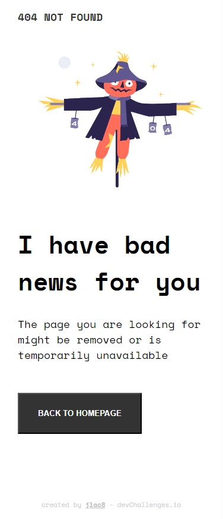
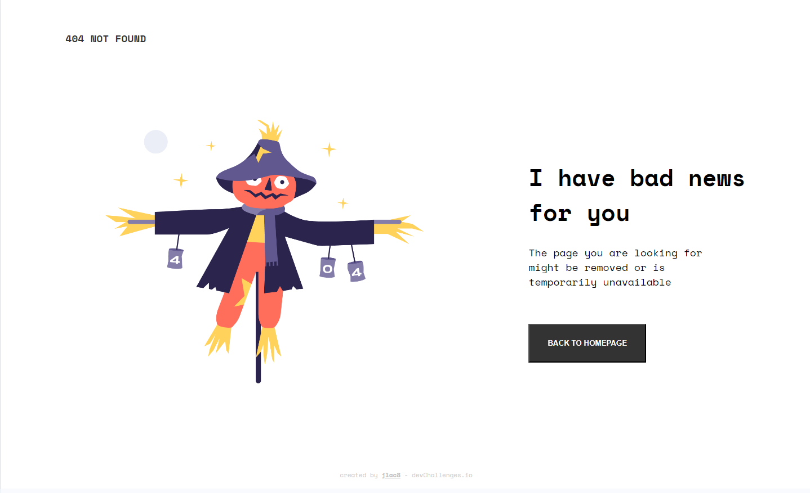

# Make It Real - 404-page

This is a solution to the 404-not-found-page project of the Make It Real top fullstack developer program.

## Table of contents

- [Overview](#overview)
  - [The challenge](#the-challenge)
  - [Screenshot](#screenshot)
- [My process](#my-process)
  - [Built with](#built-with)
  - [What I learned](#what-i-learned)
  - [Continued development](#continued-development)
  - [Useful resources](#useful-resources)
- [Author](#author)
- [Acknowledgments](#acknowledgments)

## Overview

### The challenge

Users should be able to:

- Open the URL in a web browser
- Ajust the dimension of the device and see a responsive page

### Screenshot




## My process

1. Learn how to make responsive web apps
2. Create Semantic HTML Structure
3. Set up two div elements - one to hold the image and the other for the text and button
4. Apply global css style adding the font [Space Mono](https://fonts.google.com/specimen/Space+Mono)
5. Style the Header
6. Style the Main including the button
7. Style the Footer
8. Center for Mobile Version
9. Add Margins
10. Position Footer at the Bottom
11. Set two columns for larger screens
12. Ensure full responsiveness up to desktop

### Built with

- Semantic HTML5 markup
- CSS custom properties
- Flexbox
- Mobile-first workflow

### What I learned

Make responsive apps using @media

```css
@media (min-width: 800px) {
  main {
    flex-direction: row;
    align-items: center;
  }

  .scarecrow, .message {
    margin-top: 0; 
  }
}
```

### Continued development

I'm not completely comfortable with flex properties

### Useful resources

- [Example resource 1](https://www.example.com) - This helped me for XYZ reason. I really liked this pattern and will use it going forward.

## Author

- Linkedin - [Juan Alva](https://www.linkedin.com/in/juan-luis-alva/)

## Acknowledgments

This is where you can give a hat tip to anyone who helped you out on this project. Perhaps you worked in a team or got some inspiration from someone else's solution. This is the perfect place to give them some credit.
